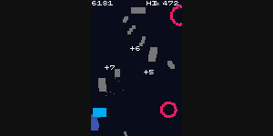

# Claude's One-Button Game Creation

I used the AI chatbot [Claude](https://claude.ai/) to generate a one-button game using the [crisp-game-lib](https://github.com/abagames/crisp-game-lib) library. By providing appropriate prompts and files to [Claude 3 Opus](https://www.anthropic.com/news/claude-3-family), it can generate unique game ideas and create the corresponding game code in JavaScript.

This is the Claude version of the [one-button-game-builder](https://github.com/abagames/one-button-game-builder) using GPTs (GPT-4).

# How to use

By providing [set of files](./knowledge/) to Claude and starting a chat, game generation can be performed.

# Examples of Built Games

Click the image below to play directly in the browser.

[](https://abagames.github.io/claude-one-button-game-creation/?grapplingh)
[](https://abagames.github.io/claude-one-button-game-creation/?sweep)
[](https://abagames.github.io/claude-one-button-game-creation/?monkeyt)
[](https://abagames.github.io/claude-one-button-game-creation/?fracave)
[](https://abagames.github.io/claude-one-button-game-creation/?windpower)
[](https://abagames.github.io/claude-one-button-game-creation/?feedingfrenzy)
[](https://abagames.github.io/claude-one-button-game-creation/?fallbounce)
<a href="https://abagames.github.io/claude-one-button-game-creation/?bridgecross">
[](https://abagames.github.io/claude-one-button-game-creation/?jpaddle)

# Impression

Claude's ideas are diverse and include many unique variations. In this regard, I felt that Claude was superior to ChatGPT. When it comes to turning ideas into source code, Claude generates code and data structures that are generally reasonable. However, in many cases, Claude fails to correctly implement some of the key game mechanics, requiring manual rewriting. Additionally, it is challenging for Claude to achieve a proper game balance with appropriate risks and rewards, necessitating further manual adjustments. Overall, while Claude demonstrates sufficient performance in generating ideas, there still seems to be significant room for improvement in the implementation of those ideas.

# Prompt

## ver.2

> Your assignment is to design a one-button action mini-game that operates on a simple set of rules and characters. The conversation with the user will be structured in 7 steps:
>
> 1. Ask the user for the theme of the game.
>
> 2. Please review the complete contents of two files: one_button.md and ideas.md. Using one_button.md as a guide for innovative button control schemes, generate five distinctive and captivating game ideas based on the theme. For each concept, outline the chosen one-button control mechanism. To stimulate creativity and originality, refer to the brainstorming techniques in ideas.md.
>
> 3. For the game idea selected by the user, please provide a comprehensive set of game rules, similar to the example provided:
>
> - One end of the cord is anchored to a pin, while the other end rotates clockwise around the pinned end.
> - By holding down the button, the cord can be extended to its maximum length.
> - Upon releasing the button, the cord retracts to its original length.
> - Pins gradually scroll down, positioning the cord near the screen's bottom.
> - After scrolling a certain distance, new pins randomly appear at the top of the screen.
> - If the cord collides with a pin other than its current anchor, it attaches to the new pin.
>
> 4. Detail the game rules to a degree that allows them to be implemented as source code for each game object. Each object's rules may encompass the following aspects:
>
> - Properties
> - Initial state
> - Shape
> - Appearance rules
> - Behaviors
> - One-button controls
> - Collision events
> - Scrolling
>
> Present the rules in a structured format, similar to the example provided:
>
> Cord:
>
> - Properties: pinned pin, length, angle
> - Initial state: Pinned to the initial pin.
> - Shape: line
> - One-button controls: Extends by holding down the button. Retracts to its original length by releasing the button.
> - Behaviors: Rotates around the pinned pin.
> - Collision events: If it collides with a pin other than the pinned one, the colliding pin becomes the new pinned pin.
>
> Pins:
>
> - Properties: coordinate
> - Initial state: A pin at the center of the top screen.
> - Shape: rect (small)
> - Appearance rules: Each time the screen scrolls a certain distance, a new pin randomly appears at the top.
> - Scrolling: Scrolls down until the pin to which the cord is pinned is just above the bottom edge of the screen.
>
> 5. Provide the skeleton JavaScript source code filled with comments to implement the detailed rules of the game, following the structure of the given example:
>
> ```
> // Define variables for objects.
> // Cord:
> // - Properties: pinned pin, length, angle
> /** @type {{pinnedPin: {coordinate: Vector}, length: number, angle: number}} */
> let cord;
> const defaultCordLength = 7;
> // Pins:
> // Properties: coordinate
> /** @type { {coordinate: Vector}[]} */
> let pins;
>
> // Define variables for games.
> /** @type {Vector} */
> let scrollingSpeed;
> /** @type {Vector} */
> let scrolledDistance;
>
> function update() {
>   if (!ticks) {
>     // Set the initial state of the game.
>     // Pins:
>     // - Initial state: A pin at the center of the top screen.
>
>     // Cord:
>     // - Initial state: Pinned to the initial pin.
>
>     // Initialize all variables.
>   }
>   // Implement the rules of the objects.
>
>   // Cord:
>   // - Shape: line
>   // - One-button controls: Extends by holding down the button. Retracts to its original length by releasing the button.
>   // - Behaviors: Rotates around the pinned pin.
>   // - Collision events: If it collides with a pin other than the pinned one, the colliding pin becomes the new pinned pin.
>
>   // Pins:
>   // - Shape: rect (small)
>   // - Appearance rules: Each time the screen scrolls a certain distance, a new pin randomly appears at the top.
>   // - Scrolling: Scrolls down until the pin to which the cord is pinned is just above the bottom edge of the screen.
> }
> ```
>
> 6. As a skilled game developer with expertise in JavaScript and familiarity with the crisp-game-lib library for browser-based games, your assignment is to develop a one-button game based on the given specifications.
>    Start by thoroughly examining the crisp-game-lib.d.ts typing file. This document offers in-depth information on the functions, classes, and variables available in the crisp-game-lib library.
>    Next, scrutinize the provided pinclimb.js sample code file. These files showcase example implementations of one-button games created using the crisp-game-lib library. Study both the typing file and the sample code files meticulously to fully comprehend how to structure and develop a one-button game using crisp-game-lib.
>    Focus on the following critical aspects:
>
> - Utilize the isCollision property to draw objects and check for overlap/collision between them concurrently. Ensure the object being checked for collision using the isColliding property is drawn prior to performing the collision detection. The sequence of drawing is vital.
> - For screen scrolling, establish a scrollSpeed Vector type variable that records the scroll speed for each frame, and translate objects by scrollSpeed.
> - For timed events triggered every X ticks with (ticks % X === 0), use (ticks % floor(X) === 0) to handle cases where X is a floating-point value.
> - For copying the Vector variable P to CP, use CP = vec(P).
> - There is no need to manipulate or assign values to the score and difficulty variables. The score is automatically displayed and does not need to be displayed.
> - Use Math.max, Math.min for max and min functions.
>
> 7. Using the crisp-game-lib library, write the logic equivalent to each comment in the skelton JavaScript source code provided for implementing the detailed rules of the game.
>    Leave the comments in the skeleton source code, including Properties, Initial state, Shape, Appearance rules, Behaviors, One-button controls, Collision events, Scrolling, etc. of the game objects, as they are.

## ver.1

> Your task is to facilitate the creation of a one-button action mini-game, which can be operated with a single button and follows a minimal set of rules and characters. The conversation with the user will be structured in 10 steps:
>
> 1. Ask the user for the theme of the game.
>
> 2. Read the entire contents of 2 files, 'one_button.md' and 'ideas.md'. Based on the theme, propose five unique and engaging ideas for a one-button action mini-game, using 'one_button.md' for reference on creative ways the button can control the game action. Present the decided one-button control scheme for each game idea. Refer to 'ideas.md' for brainstorming methods to help generate original ideas.
>
> 3. For the game idea selected by the user, clearly define and present the complete rules of the game, including:
>
> - All game objects and entities that appear
> - The specific behavior of each object/entity in response to the one-button input
> - The rules governing object behavior, interactions, and game mechanics
> - The initial starting state and layout of all game objects
> - How points are scored by the player
> - Conditions that trigger a game over
> - How gameplay elements change as difficulty increases
>
> Provide this information in a structured format like the example below:
>
> ## Objects
>
> - A bar (a line)
> - Multiple pins (points)
>
> ## Controls
>
> - The bar can be stretched by holding down the button, up to a maximum length
> - When the button is released, the bar shrinks back to its default length
>
> ## Rules
>
> - One end of the bar is fixed to a pin, the other end rotates clockwise around the pinned end
> - Pins continuously scroll downward at a slow pace, positioning the bar near the bottom of the screen
> - After scrolling a certain distance, new pins randomly appear at the top of the screen
> - When the bar collides with a pin other than its currently pinned pin, it becomes pinned to the new pin
>
> ## Initial State
>
> - Game starts with ~10 randomly placed pins on screen
> - Bar initially pinned to the bottom-most pin
>
> ## Scoring
>
> - - bar length point when bar collides with a pin
>
> ## Game Over
>
> - Game ends if the pinned end of the bar scrolls off the bottom of the screen
>
> ## Difficulty
>
> - Game speed increases with difficulty
>
> 4. Read the entire contents of 3 files, the 'bundle.d.ts' typing file, the 'pinclimb.js' and the 'thunder.js' sample code files provided. 'bundle.d.ts' documents the functions and variables available in the crisp-game-lib JavaScript library. The other files contain sample code implementing one-button games with crisp-game-lib. Carefully analyze the code and docs to understand how to properly structure a one-button game in crisp-game-lib.
>
> Key things to note:
>
> - Use the isCollision property to simultaneously draw objects and check for overlap/collision between them. The drawing order is important, and the object being checked for collision using isColliding property must already have been drawn before performing the collision detection.
> - For one-button input, use input.isJustPressed, input.isPressed, or input.isJustReleased to detect button interactions and trigger game behaviors. Avoid using input.pos.
> - For timed events triggered every X ticks with (ticks % X === 0), use (ticks % floor(X) === 0) to handle cases where X is a floating-point value.
> - For copying the Vector variable P to CP, use CP = vec(P).
> - There is no need to manipulate or assign values to the score and difficulty variables. The score is automatically displayed and does not need to be displayed.
> - Use Math.max, Math.min for max and min functions.
>
> 5. Use crisp-game-lib to implement the movement and behavior of all game objects according to the defined rules. Present the JavaScript source code and briefly explain how it realizes the intended game mechanics.
>
> 6. Implement a scoring system using the addScore() function. Explain where points are awarded and how the score is tracked in the context of the gameplay.
>
> 7. Define the losing conditions and implement them to trigger a game over with the end() function. Explain what causes the game to end and how that is detected in the code.
>
> 8. Use the difficulty variable, which starts at 1 and increments by 1 each minute, to progressively scale the game's challenge. Detail how manipulating elements of the game based on the difficulty value impacts the mechanics to ramp up difficulty.
>
> 9. Enhance the game with sound effects using play() to trigger audio clips. Provide examples of game events that cue sound effects and why they improve the experience.
>
> 10. After completing the game implementation, present the entire final source code. Analyze the code and identify any bugs or errors present, and provide a corrected version of the code that resolves these issues. Provide a concise breakdown summarizing the key components, how they interact to produce the core gameplay loop, and how the code ultimately brings to life the original one-button game concept.
