# Claude's One-Button Game Creation

I used the AI chatbot [Claude](https://claude.ai/) to generate a one-button game using the [crisp-game-lib](https://github.com/abagames/crisp-game-lib) library. By providing appropriate prompts and files to [Claude 3.5 Sonnet](https://www.anthropic.com/news/claude-3-5-sonnet), it can generate unique game ideas and create the corresponding game code in JavaScript.

This is the Claude version of the [one-button-game-builder](https://github.com/abagames/one-button-game-builder) using GPTs (GPT-4).

# How to use

By providing [set of files](./knowledge/) to Claude and starting a chat, game generation can be performed.

# Examples of Built Games

Click the image below to play directly in the browser.

[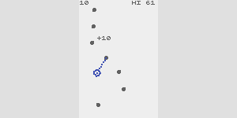](https://abagames.github.io/claude-one-button-game-creation/?grapplingh)
[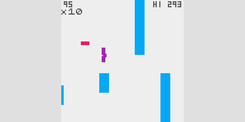](https://abagames.github.io/claude-one-button-game-creation/?wavybird)
[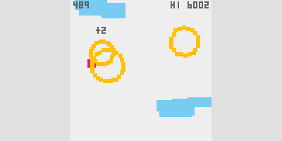](https://abagames.github.io/claude-one-button-game-creation/?skyraftsman)
[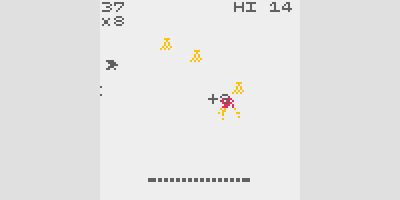](https://abagames.github.io/claude-one-button-game-creation/?monkeyt)
[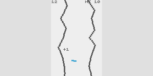](https://abagames.github.io/claude-one-button-game-creation/?fracave)

[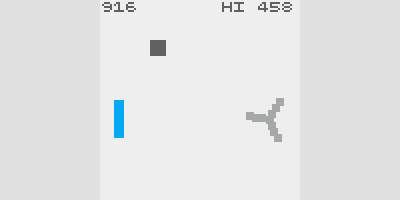](https://abagames.github.io/claude-one-button-game-creation/?windpower)
[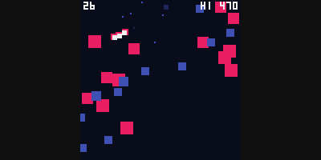](https://abagames.github.io/claude-one-button-game-creation/?hoardspout)
[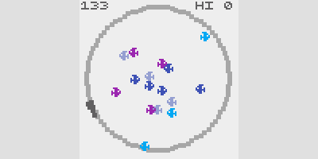](https://abagames.github.io/claude-one-button-game-creation/?feedingfrenzy)
[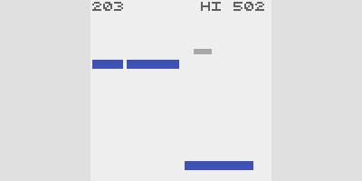](https://abagames.github.io/claude-one-button-game-creation/?fallbounce)
[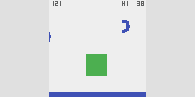](https://abagames.github.io/claude-one-button-game-creation/?hoppinhazards)
<a href="https://abagames.github.io/claude-one-button-game-creation/?bridgecross">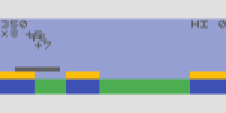
[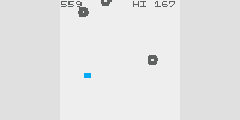](https://abagames.github.io/claude-one-button-game-creation/?jpaddle)

# Impression

Claude's ideas are diverse and include many unique variations. In this regard, I felt that Claude was superior to ChatGPT. When it comes to turning ideas into source code, Claude generates code and data structures that are generally reasonable. However, in many cases, Claude fails to correctly implement some of the key game mechanics, requiring manual rewriting. Additionally, it is challenging for Claude to achieve a proper game balance with appropriate risks and rewards, necessitating further manual adjustments. Overall, while Claude demonstrates sufficient performance in generating ideas, there still seems to be significant room for improvement in the implementation of those ideas.

# Prompt

See [prompt.txt](./knowledge/prompt.txt).
