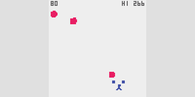

# Claude's One-Button Game Creation

I used the AI chatbot [Claude](https://claude.ai/) to generate a one-button game using the [crisp-game-lib](https://github.com/abagames/crisp-game-lib) library. By providing appropriate prompts and files to [Claude 3.5 Sonnet](https://www.anthropic.com/news/claude-3-5-sonnet), it can generate unique game ideas and create the corresponding game code in JavaScript.

# How to use

By dropping [set of 5 files in the chat_knowledge directory](./chat_knowledge/) into the chat session of Claude and starting a chat, game generation can be performed.

You can also give [files in the project_knowledge directory](./project_knowledge/) to [project knowledge](https://www.anthropic.com/news/projects) for use.

First, enter the theme of the game you want to create. If necessary, type 'proceed' to proceed to the next step.

# Examples of Built Games

Click the image below to play directly in the browser.

<a href="https://abagames.github.io/claude-one-button-game-creation/?bridgecross">

# Prompt

See [prompt.txt](./chat_knowledge/prompt.txt)

By using the prompts in the [game_description_prompt directory](./game_description_prompt/), you can generate markdown files from the source code that explain the rules of the game and other information. The generated markdown files can be used as the project knowledge.

# Generative Reroll Game Development

LLMs like Claude can now generate simple games. While often flawed, occasional gems emerge. By iterating and refining LLM outputs, developers can create unique, playable games—a process called Generative Reroll Game Development.

- [Generative Reroll Game Development Using LLMs](https://dev.to/abagames/generative-reroll-game-development-using-llms-22m3)
