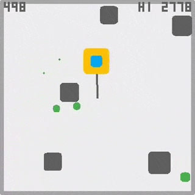

# Claude's One-Button Game Creation

I used the AI chatbot [Claude](https://claude.ai/) to generate a one-button game using the [crisp-game-lib](https://github.com/abagames/crisp-game-lib) library. By providing appropriate prompts and files to [Claude 4](https://www.anthropic.com/news/claude-4), it can generate unique game ideas and create the corresponding game code in JavaScript.

# How to use

## For Claude Code Users

If you're using [Claude Code](https://claude.ai/code), ensure both the [CLAUDE.md](./CLAUDE.md) file and the [cc_knowledge/](./cc_knowledge/) directory are in your project directory. This file provides guidance for working with the comprehensive documentation guides:

- **Design Phase**: Use `cc_knowledge/one-button-game-design-guide.md` for systematic idea generation using verb matrices and validation frameworks
- **Implementation Phase**: Use `cc_knowledge/one-button-game-implementation-guide.md` and `cc_knowledge/crisp-game-lib-guide.md` for development

The repository now focuses on documentation and methodology rather than autonomous generation.

## Archived Game Creation Prompts

Previous autonomous game creation prompts have been moved to the [toy-creation-prompts/](./toy-creation-prompts/) directory:

- `toy-creation-prompts/CLAUDE.md` - Original comprehensive game creation workflow
- `toy-creation-prompts/GEMINI.md` - Gemini CLI-specific instructions

These can still be used for automated game generation by referencing the appropriate prompt file.

### From Toys to Games

Claude Code creates initial game prototypes in the `./tmp/games/` directory. These creations are designed as "toys" rather than complete games - they focus on core mechanics and safe experimentation without traditional game-over conditions.

To develop these into full games:

1. **Explore the toys** - Play through the generated prototypes to understand their mechanics
2. **Select promising concepts** - Choose the most interesting and engaging toy prototypes
3. **Refine with Vibe Coding** - Use an iterative, intuitive development approach to enhance the selected toys into polished games with proper challenge, progression, and game feel

This workflow encourages creative experimentation and iterative refinement from initial concept to final game.

## For Other Claude Interfaces

By dropping [set of 5 files in the chat_knowledge directory](./chat_knowledge/) into the chat session of Claude and starting a chat, game generation can be performed.

You can also give [files in the project_knowledge directory](./project_knowledge/) to [project knowledge](https://www.anthropic.com/news/projects) for use.

For [Cursor's agent mode](https://docs.cursor.com/chat/agent), you can use [cursor_knowledge/prompt.md](./cursor_knowledge/prompt.md). This prompt contains a mechanism for simulation-based concept selection, realized in [ChatCraftClick](https://github.com/abagames/chat-craft-click).

First, enter the theme of the game you want to create. If necessary, type 'proceed' to proceed to the next step.

# Examples of Built Games

[Jet Stream](https://abagames.github.io/claude-one-button-game-creation/?jet-stream)

https://github.com/user-attachments/assets/12ddf60b-f65a-4976-9c34-4e0db514aea4

Click the image below to play directly in the browser.

[GRAVITY BUBBLE](https://abagames.github.io/claude-one-button-game-creation/?gravity-bubble) /
[TROJAN DEFENSE](https://abagames.github.io/claude-one-button-game-creation/?trojan-defense) /
[LEVITATION](https://abagames.github.io/claude-one-button-game-creation/?levitation) /
[TURBO TUNNEL](https://abagames.github.io/claude-one-button-game-creation/?turbotunnel) /
[VINE CLIMBER](https://abagames.github.io/claude-one-button-game-creation/?vineclimber) /
[BLADE DANCER](https://abagames.github.io/claude-one-button-game-creation/?bladedancer) /
[WIND POWER](https://abagames.github.io/claude-one-button-game-creation/?windpower) /
[ROTATION ROD](https://abagames.github.io/claude-one-button-game-creation/?rotationrod) /
[BASERUNNER DASH](https://abagames.github.io/claude-one-button-game-creation/?baserunnerdash) /
[FISH GRILL](https://abagames.github.io/claude-one-button-game-creation/?fishgrill) /
[ELASTIC HERO](https://abagames.github.io/claude-one-button-game-creation/?elastichero) /
[STOMPING BUBBLES](https://abagames.github.io/claude-one-button-game-creation/?stompingbubbles) /
[TWIN JUMPERS](https://abagames.github.io/claude-one-button-game-creation/?twinjumpers) /
[SLIME STRETCHER](https://abagames.github.io/claude-one-button-game-creation/?slimestretcher) /
[KNIGHT SPAWNS](https://abagames.github.io/claude-one-button-game-creation/?knightvspawns) /
[STAGE SEPARATION](https://abagames.github.io/claude-one-button-game-creation/?stageseparation)

The game code is in [the docs directory](./docs/).

# Can AI Chatbots Create New Games?

Recent improvements in LLM performance have enabled them to handle many aspects of small game development. I wrote the article about the small game development process using chatbots.

- [Can AI Chatbots Create New Games?](https://abagames.github.io/joys-of-small-game-development-en/generation/can_ai_chatbot_create_game.html)

Using generative AI, you can create both images and sounds for games.

- [Creating Mini-Games in the Age of Generative AI - Generating Ideas, Code, Graphics, and Sound](https://dev.to/abagames/creating-mini-games-in-the-age-of-generative-ai-generating-ideas-code-graphics-and-sound-424k)
