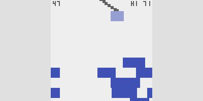

# Claude's One-Button Game Creation

I used the AI chatbot [Claude](https://claude.ai/) to generate a one-button game using the [crisp-game-lib](https://github.com/abagames/crisp-game-lib) library. By providing appropriate prompts and files to [Claude 3.5 Sonnet](https://www.anthropic.com/news/claude-3-5-sonnet), it can generate unique game ideas and create the corresponding game code in JavaScript.

# How to use

By dropping [set of 5 files in the chat_knowledge directory](./chat_knowledge/) into the chat session of Claude and starting a chat, game generation can be performed.

You can also give [files in the project_knowledge directory](./project_knowledge/) to [project knowledge](https://www.anthropic.com/news/projects) for use.

First, enter the theme of the game you want to create. If necessary, type 'proceed' to proceed to the next step.

# Examples of Built Games

Click the image below to play directly in the browser.

<a href="https://abagames.github.io/claude-one-button-game-creation/?bridgecross">

# Prompt

See [prompt.txt](./project_knowledge/prompt.txt)

By using the prompts in the [game_description_prompt directory](./game_description_prompt/), you can generate markdown files from the source code that explain the rules of the game and other information. The generated markdown files can be used as the project knowledge.

# Can AI Chatbots Create New Games?

Recent improvements in LLM performance have enabled them to handle many aspects of small game development. I wrote the article about the small game development process using chatbots.

- [Can AI Chatbots Create New Games?](https://abagames.github.io/joys-of-small-game-development-en/generation/can_ai_chatbot_create_game.html)
